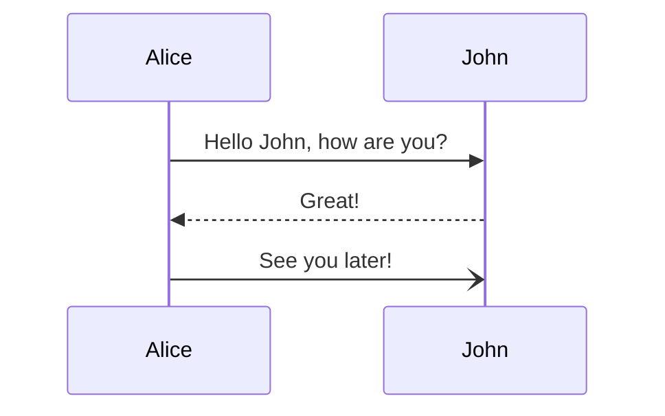

# Templates

All Docusaurus markdown files templates

## Normal text

Lorem ipsum

## Bold text

Lorem **ipsum**

## Italic text

Lorem _ipsum_

## Text with box

Lorem `ipsum`

## List

Your docs now have 2 versions:

- Point 1
- Point 2

## Code-Box with title

```jsx title="/src/components/HelloCodeTitle.js"
function HelloCodeTitle(props) {
  return <h1>Hello, {props.name}</h1>;
}
```

## Code-Box without title

```jsx
function HelloCodeTitle(props) {
  return <h1>Hello, {props.name}</h1>;
}
```

## Code-Box with Line highlighting

```js title="docusaurus.config.js"
module.exports = {
  themeConfig: {
    navbar: {
      items: [
        // highlight-start
        {
          type: "docsVersionDropdown",
        },
        // highlight-end
      ],
    },
  },
};
```

## Code-Box with Line numbering and highlighting

```jsx {1,4-6,11} showLineNumbers
import React from "react";

function MyComponent(props) {
  if (props.isBar) {
    return <div>Bar</div>;
  }

  return <div>Foo</div>;
}

export default MyComponent;
```

## General-Box without title

```bash
npm run docusaurus docs:version 1.0
```

## Admonitions

:::note

Some **content** with _Markdown_ `syntax`. Check [this `api`](#).

:::

:::tip

Some **content** with _Markdown_ `syntax`. Check [this `api`](#).

:::

:::info

Some **content** with _Markdown_ `syntax`. Check [this `api`](#).

:::

:::caution

Some **content** with _Markdown_ `syntax`. Check [this `api`](#).

:::

:::danger

Some **content** with _Markdown_ `syntax`. Check [this `api`](#).

:::

:::note Your Title

Some **content** with _Markdown_ `syntax`.

:::

## Image

The docs version dropdown appears in your navbar:


## Link

Your localized site is accessible at [http://localhost:3000/](http://localhost:3000/fr/)

## Files

[Download this docx using Markdown](./img/docsVersionDropdown.png)

## Diagrams

### Flow diagram


### Sequence diagram



See the [Mermaid syntax documentation](https://mermaid.js.org/intro/) for more information on the Mermaid syntax.
